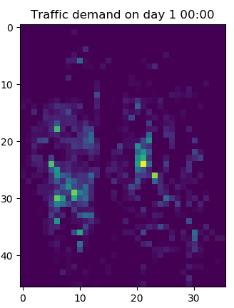
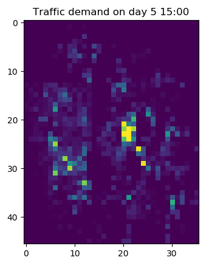

# Grab AI for S.E.A.: Traffic Management Challenge
by Jia Yuan Chia

This repository is a submission for Grab AI for SEA challenge: Traffic Management Challenge.

The competition requires participants to build a model trained on a historical demand dataset, that can forecast demand on a Hold-out test dataset. 
The model should be able to accurately forecast ahead by T+1 to T+5 time intervals (where each interval is 15-min) given all data up to time T.

## Model Concept and Explanation
In the provided training data on booking demand, the geohashes are able to be decoded into a total of 46 unique latitudes and 36 unique longitudes,
where they can then be plotted into a 46 x 36 grid of traffic demand data.
To process the provided data, they were first splitted by their corresponding day and timesteps. 
Then, the traffic demands for each geohash on that specific day and timesteps are used to be plotted into an image of 46 x 36.

Sample visualization on booking demand plots:

After plotting the data into the booking demand plots, there will be a total of 96 plots for each day (96 distinct timesteps), 
and a total of 5856 plots over 61 days.

These plots are then being fed into a 4 layered ConvLSTM2D neural network, which is used to train for the prediction of subsequent booking demand plots.
