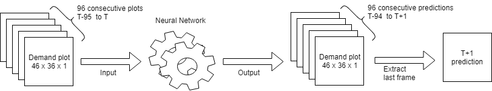

# Grab AI for S.E.A.: Traffic Management Challenge
by Jia Yuan Chia

This repository is a submission for Grab AI for SEA challenge: [Traffic Management Challenge](https://www.grab.com/sg/aiforsea/).

The competition requires participants to build a model trained on a historical demand dataset, that can forecast demand on a Hold-out test dataset. 
The model should be able to accurately forecast ahead by T+1 to T+5 time intervals (where each interval is 15-min) given all data up to time T.

## Model Concept and Explanation
In the provided training data on booking demand, the raw data are being preprocessed into the following columns:

| Columns        | Description           |
| -------------- | --------------------- |
| geohash6       | Original provided dataset to represent location |
| day            | Original provided dataset to represent which consecutive days in dataset |
| timestamp      | Original provided dataset to represent time of day |
| demand         | Original provided dataset to represent booking demand of that location in that particular timestep and day |
| latitude       | Latitude value decoded from geohash |
| longitude      | Longitude value decoded from geohash |
| normalizedTime | Normalized timesteps in the day, where each value represents 15-min slice. (0 = 00:00, 1 = 00:15, 2 = 00:30, etc...) |
| normalizedDayTime | Normalized overall timesteps over 61 days, where each value represents 15-min slice. (0 = day 1 00:00, 1 = day 1 00:15, 96 = day 2 00:00, etc...) |
| Xcoord | Normalized X coordinates = ( longitudes - min value in all longitudes ) / each longitude step |
| Ycoord | Normalized Y coordinates = ( latitudes - min value in all latitudes ) / each latitude step |

The geohashes are able to be decoded into a total of 46 unique latitudes and 36 unique longitudes, where they can then be plotted into a 46 x 36 grid of traffic demand data.
To process the provided data, they were first splitted by their corresponding day and timesteps. 
Then, the traffic demands for each geohash on that specific day and timesteps are used to be plotted into an image of 46 x 36.

Sample visualization on booking demand plots:


After plotting the data into the booking demand plots, there will be a total of 96 plots for each day (96 distinct timesteps), 
and a total of 5856 plots over 61 days.

These plots are then packed into 96 consecutive plots per training sample, which means each training sample is 96 x 46 x 36 x 1 (96 consecutive demand plots image in single channel). They are then fed into a neural network where it is used to train the model for predictions of next plot. 



The model summary is as below:

```
_________________________________________________________________
Layer (type)                 Output Shape              Param #   
=================================================================
conv_lst_m2d_1 (ConvLSTM2D)  (None, None, 46, 36, 32)  38144     
_________________________________________________________________
batch_normalization_1 (Batch (None, None, 46, 36, 32)  128       
_________________________________________________________________
conv_lst_m2d_2 (ConvLSTM2D)  (None, None, 46, 36, 32)  73856     
_________________________________________________________________
batch_normalization_2 (Batch (None, None, 46, 36, 32)  128       
_________________________________________________________________
conv_lst_m2d_3 (ConvLSTM2D)  (None, None, 46, 36, 32)  73856     
_________________________________________________________________
batch_normalization_3 (Batch (None, None, 46, 36, 32)  128       
_________________________________________________________________
conv_lst_m2d_4 (ConvLSTM2D)  (None, None, 46, 36, 32)  73856     
_________________________________________________________________
batch_normalization_4 (Batch (None, None, 46, 36, 32)  128       
_________________________________________________________________
conv3d_1 (Conv3D)            (None, None, 46, 36, 1)   865       
=================================================================
Total params: 261,089
Trainable params: 260,833
Non-trainable params: 256
_________________________________________________________________
```

The model is a 4 layered Convolutional LSTM 2D with 32 neurons each with Batch Normalization after every layer. The output layer is a Convolutional 3D layer to produce prediction in the same format as input 96 x 46 x 36 x 1. The selection of this model is inspired by the paper "[Convolutional LSTM Network: A Machine Learning Approach for Precipitation Nowcasting](https://arxiv.org/pdf/1506.04214.pdf)" where it focus on spatiotemporal sequence to perform nowcasting (prediction of the present, the very near future and the very recent past).
Another reference for this model is video frame prediction techniques, where a time series of 2d images are used to predict the next frame of video. As the processed data does bear resemblance to a video (time-consecutive 2d plots in single channel), the model has to take into account the 2d spatial relationship between different/adjacent geohashes as well as the historical demand of the region. Hence, a ConvLSTM2D-based model is selected.

The prediction method is to use the model to predict a new booking demand plot for T+1, where it's input data consists of 96 previous demand plots (T-95 to T, equivalent to 1 day's data).
With that data, the model then predicts the T+1 demand plot.
From there, the T+1 plot is added into the input data and the T-95 plot is removed from the input data.
The input data is then used to predict T+2 booking demand plot.
The process is then repeated until T+5 is predicted.

## Getting Started
Simply download the project and unzip it.

## Run the prediction with hold-out test set
To produce the booking predictions for T+1 to T+5, just run the evaluation_script.py file. It will prompt you to enter the file path of test dataset csv file:


Enter the file path to the hold out test dataset, and it will then write a predictions.csv file into the same directory as the evaluation_script.py.

The predictions.csv will have the following format:

| Columns    | Description           |
| ---------- | --------------------- |
| latitude   | Latitude of the location |
| longitude  | Longitude of the location |
| geohash6   | Encoded geohash (level 6) of the location |
| prediction | Booking demand prediction of the location |
| TPlus      | T+ values (range from 1 to 5) |

## Train the neural network
To train the neural network and produce the prediction model, simply run the training_script.py file and it will read, process the data and train the neural network, then ultimately save the model into "models/final_model.h5" file.

## Folder Structure

```
.
├── datasets                  # Training dataset
│   └── traffic_management.zip
|
├── media                     # Images used in README.md
│   ├── day_1_12am.PNG
│   ├── day_5_3pm.PNG
│   └── shell_evaluation.png
|
├── models                    # Saved models used for testing, tuning and final evaluation
│   ├── conv_lstm_time48_filter32_batch4_full.h5
│   ├── conv_lstm_time48_filter32_lyr4_batch4_trainday55.h5
│   ├── conv_lstm_time48_filter32_lyr4_batch4.h5
│   └── final_model.h5        # Final neural network model
|
├── EDA.ipynb                 # Jupyter notebook for exploratory data analysis
├── evaluation_script.py      # Script to produce evaluation predictions on hold-out test set
├── geohash.py                # Geohash script used to decode/encode geohash (https://github.com/hkwi/python-geohash)
├── preprocessing.py          # Script consists of data preprocessing functions
├── test.py                   # Script used for initial analysis and data exploration
├── traffic_conv_lstm_2d.py   # Script used for model tuning and testing
├── training_script.py        # Script used to train final model
└── README.md
```

## Results analysis and further potential improvements
A big weakness for this model is the prediction method, where it only predicts 1 future plot, and the prediction is then being fed back into the model to predict subsequent plot. This method produces an accurate T+1 predictions, but accuracy of predictions drops rapidly until T+5. This is because the error gets amplified for every prediction iteration.

An alternative way to resolve this is to prepare the training data and model to predict 5 future plots together at once. That means, to feed T-96 to T as input data, then the training results would be T-91 to T+5. This method would possibly eliminate this problem. However, due to the long training time for this model and resource limitation, I do not have sufficient time to test this method out before the deadline.

## Libraries
* [Numpy](http://www.numpy.org/) - NumPy is the fundamental package for scientific computing with Python 
* [pandas](https://pandas.pydata.org/pandas-docs/stable/) - pandas is an open source, BSD-licensed library providing high-performance, easy-to-use data structures and data analysis tools for the Python programming language.
* [keras](https://keras.io/) - Keras is a high-level neural networks API, written in Python and capable of running on top of TensorFlow, CNTK, or Theano
* [scikit-learn](https://scikit-learn.org/stable/) - scikit-learn is a machine learning library in python

## Acknowledgements
A huge thank you to Grab for organizing this machine learning challenge.
